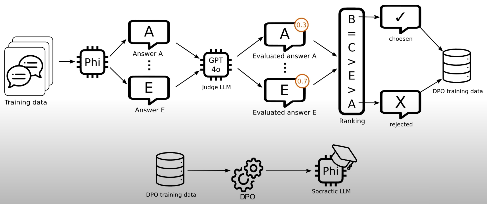
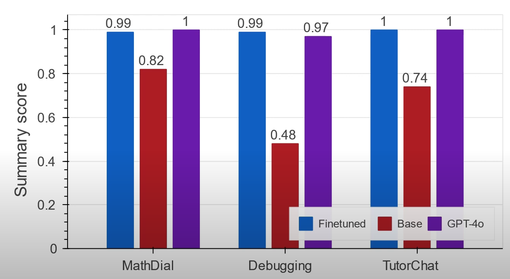
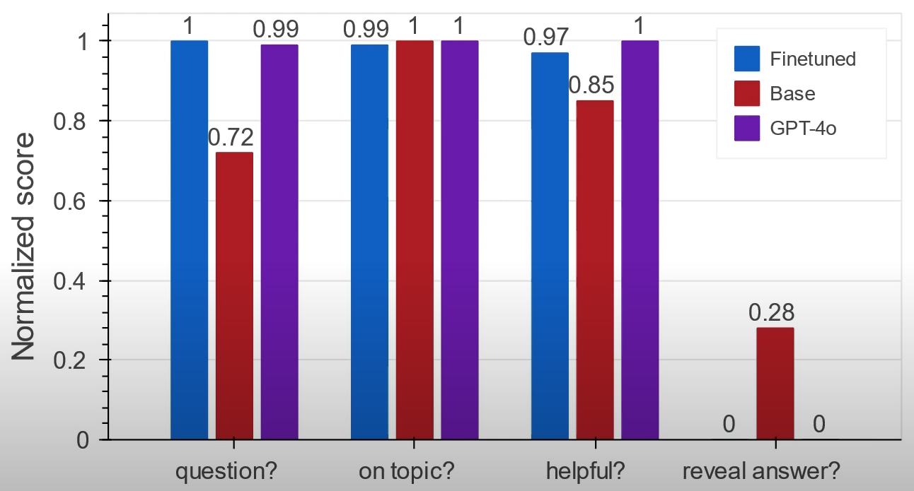

# A Method of Fine-Tuning LLMs for Socratic Interactions
## Which base LLM should we fine tune?
- The training methods explored here will allow us to fine tune any LLM of our choice for Socratic interaction.
- For the sake of example and relevance, ***Phi-3 Mini*** is chosen.
## Why Phi-3 Mini?
- ***Smaller Model Size***
  - Phi-3 Mini is significantly smaller compared to models like GPT-4 (~1T+ parameters) or even GPT-3 (~175B parameters). This makes it faster, more resource-friendly, and easily deployable locally.
- ***Cost and Accessibility***
  - Being open-source and small, Phi-3 Mini is easily accessible for researchers, developers, and hobbyists without requiring significant computational resources.
- ***Reasoning-Focused***
  - Phi-3 Mini emphasizes reasoning tasks, logical deduction, and concise responses, making it particularly suitable for tasks like question-answering, educational applications (e.g., Socratic dialogues), and inference-focused use cases.

## What is Socratic interaction?
- Socratic interaction is a form of ***argumentative dialogue*** wherein an observer challenges the implicit moral beliefs of a speaker, bringing out inconsistencies in the speaker's thinking.
- These days, it can be used as a ***pedagogical tool*** for teachers to challenge students to strive for deep conceptual understanding rather than surface-level memorization.
  - The idea is to ***allow a student to discover the answer on their own***.
## Can current LLMs be Socratic?
- They aren't for the most part, but can be instructed to behave as such with prompt engineering to a limited extent.
- Consider a chat between student and teacher, but the student is a user, and the teacher is an LLM assistant.
- Current LLMs like GPT-4o will answer questions plainly if not specifically instructed to answer Socratically with prompt engineering context.
  - Student: *Professor, how can I solve $x^2-1=0?$*
  - Teacher: *To solve the equation $x^2-1=0$, follow these steps...*
## To what extent can we prompt-engineer GPT-4o to interact Socratically?
- Especially for smaller models, prompt engineering context can only improve desired output in a limited sense.

## What is the fine-tuning training pipeline to select for native Socratic interaction?
1. ***Data Cleaning***
   1. Choose conversation as seed interactions.
2. ***Prompting to Generate Interactions***
   1. Prompt a chosen LLM to generate teacher interactions with the student.
3. ***Ranking Interactions***
   1. A more powerful "Judge" LLM then ranks these interactions according to a rubric.
   2. We define the rubric beforehand.
4. ***Fine-tuning via Direct Preference Optimization (DPO)***
   1. The ranked data is input into the Direct Preference Optimization algorithm.

## What datasets are available?
- ***TutorChat***
  - Each instance is a set of simulated GPT-3.5-turbo (Teacher) vs. GPT-3.5-turbo (Student) interactions based on one or more science textbooks.
- ***MathDial***
  - Each instance is a problem statement, a student's incorrect answer, a correct answer, and human (Teacher) vs. GPT-3.5-turbo (Student) interaction.
- ***Debugging***
  - Each instance is a problem statement, a student's code, a description of a bug, and human (Teacher) vs. human (Student) interaction.

## How can we assess the quality of Socratic interactions?
- A **Summary Score** is derived from four uniformly-weighted and normalized sub-categories:
  1. **Question (Boolean)**: Does the answer contain a *question*?
  2. **Reveal (Boolean)**: Does the answer *reveal* the correct solution?
  3. **On-Topic (Integer (1-5))**: To what extent is the answer *on-topic* with respect to the student's query?
  4. **Helpful (Integer (1-5))**: How *helpful* is the answer to reach the solution?
    - Note that for the integer interactions, 5 is the best score.

## If a Judge LLM is assessing these interactions automatically, how should we validate its assessments?
- We plot GPT-4o Score (0-1) vs. Human Score (0-1) and measure the correlation.
  - Based on a sample dataset of 100 manual human-scored evaluations, GPT-4o's scoring shows a strong Pearson correlation of 0.78.
  - We can use this as strong evidence to show that GPT-4o is a good automated judge.
  - Looking deeper, we can also explore how human evaluation differs from the Judge LLM according to the four scoring categories.

## What's next after choosing a dataset and an assessment method?
- Now we must choose an optimization algorithm.
- This can be accomplished through several options include reinforcement learning through human feedback (RLHF), several supervised learning methods, or ***Direct Preference Optimization (DPO)***.

## What is DPO and why should we use it here?
1. First, DPO is ***stable***, meaning it doesn't require extensive hyperparameter tuning.
2. Second, the training procedure is simplified because there is ***no need to train a reward model***.
3. Third, it can run with limited hardware resources since it ***doesn't require loading reward models into GPUs*** during fine tuning.

## How do all of these pieces fit together into a training pipeline?
- We start by feeding ***conversation extracts from selected datasets*** into a chosen LLM alongside detailed instructions for answering according to the Socratic method.
- We prompt the model to ***generate five different answers***.
- Then, we input each answer to GPT-4o that generates a ***summary score for each interaction*** independently.
- Given each interaction-score pair, we ***rank the pairs*** from best to worst.
- The DPO algorithm requires only one good and one bad example when performing optimization.
  - To clearly optimize between right and wrong, we ***pick the examples with the highest and lowest scores***, and all others are discarded.
- These are all put into a ***triplet bundle***:
  - 1. The Student Question
  - 2. A Good Teacher Answer
  - 3. A Bad Teacher Answer
- With the triplet, the DPO algorithm finetunes our chosen LLM.

  

## How do we test the fine-tuned model?
- Before we begin training, we could have set aside a number of samples to use for test and validation sets.
- Another approach is to fine-tune the model on one of the three available datasets (***MathDial***, ***TutorChat***, or ***Debugging***), and then test it on the other two it hasn't seen.

## How do we evaluate results?
- In this example figure, Phi-3-mini with prompt engineering only is shown in red.
- The fine-tuned version is shown in blue.
- Then, there is GPT-4o with prompt engineering only in purple.

  

## We can also look at summary score components.

  

# What contributions can this tech provide?
- We can make Socratic models for any community given a base LLM.
- A baseline rule-based assessment technique to measure Socratic behavior.
- A state-of-the-art performance with a cheap model.